## Practical 1. 
 **For steps 1-4 follow your trainer - this will be 'live-coding'.**  
>  We are going to access the GitHub web interface via 
>  our browser (www.github.com) and create our own 
> GitHub repository. Next we will cut and paste a 
> provided Markdown file into a new file in our
> repository.
> We will then allow the other students on our desk 
> access to our repos and vice-versa. We will make 
> changes in each others repository and explore how git 
> tracks and attributes the changes.    
        
1. Log into [github](github.com) using your GH account.   
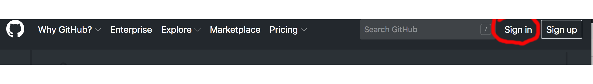 
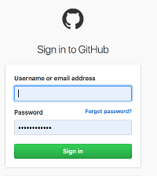
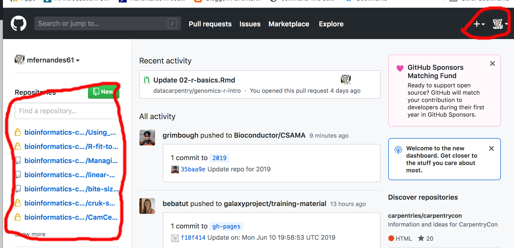 
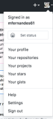     
On the LH pane, your repositories will appear here as you create them.   
On the top RH corner are two dropdown menus. The one with your GH avatar if clicked upon will provide you options to change the default settings, alter your profile, log out of GitHub etc. The other one will be used in the next step to create a new GH repository.   
2. Create a new repository.   
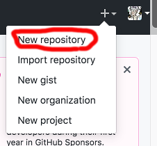     
When you have several repos created, Github will list them like this:   
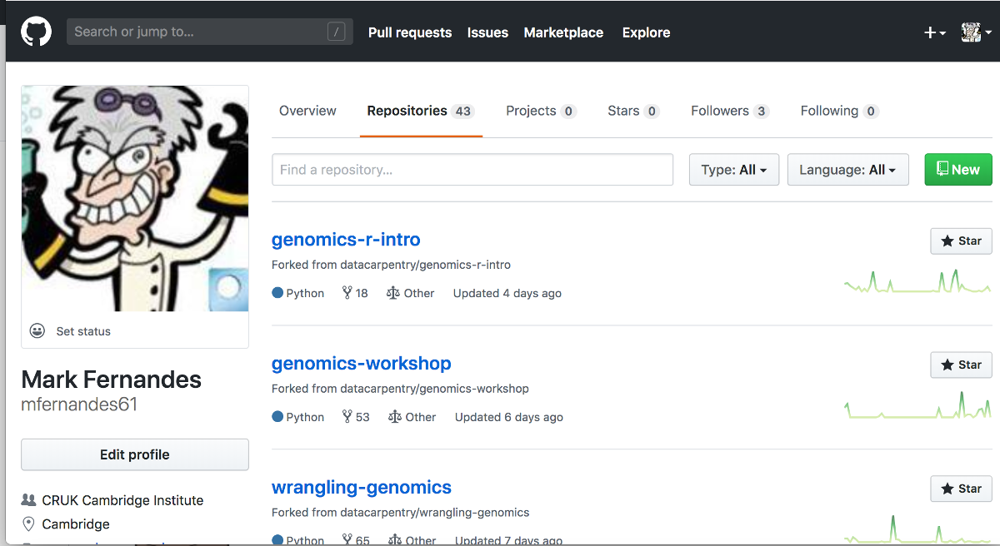 
3. We have created an Example.md Markdown file in this GitHub repo with several example used of Markdown.
[To get a copy of this file, click & download this linked file (Ctrl-click).](https://raw.githubusercontent.com/bioinformatics-core-shared-training/Using_Git_with_R/master/Example.md?token=ADJJD7RWPSCIF3S5ANU4TCC5DXF7G). If this link doesn't work then go [here](Example.md), click on the 'raw' button and copy the MarkDown text.
Click on the Create new file button, name it, paste the markdown code into the new file and click the commit button (For extra credit type in a helpful extra description).   
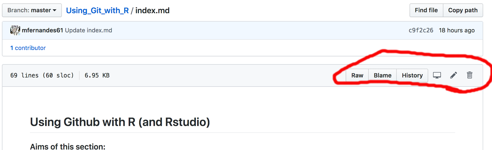 
4. Add the the Github usernames for the people on your desk and allow them write privileges to your repsotory and get them to do the same for you on theirs.    
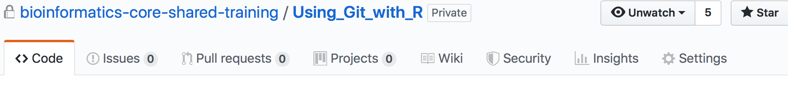 
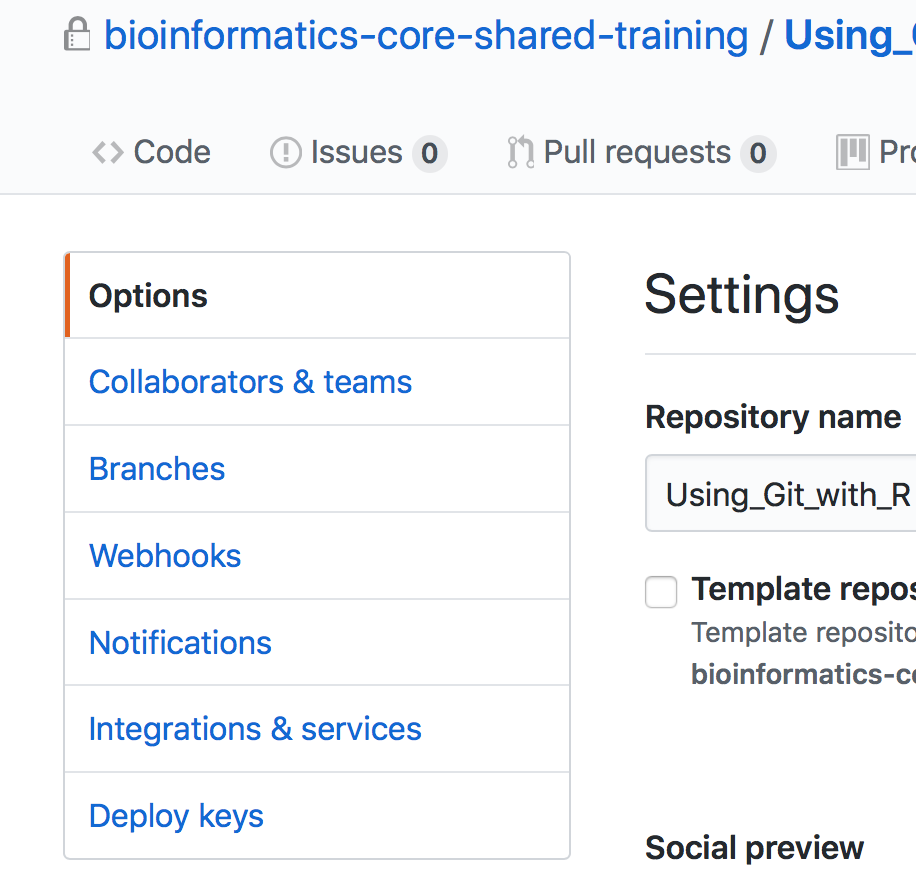 
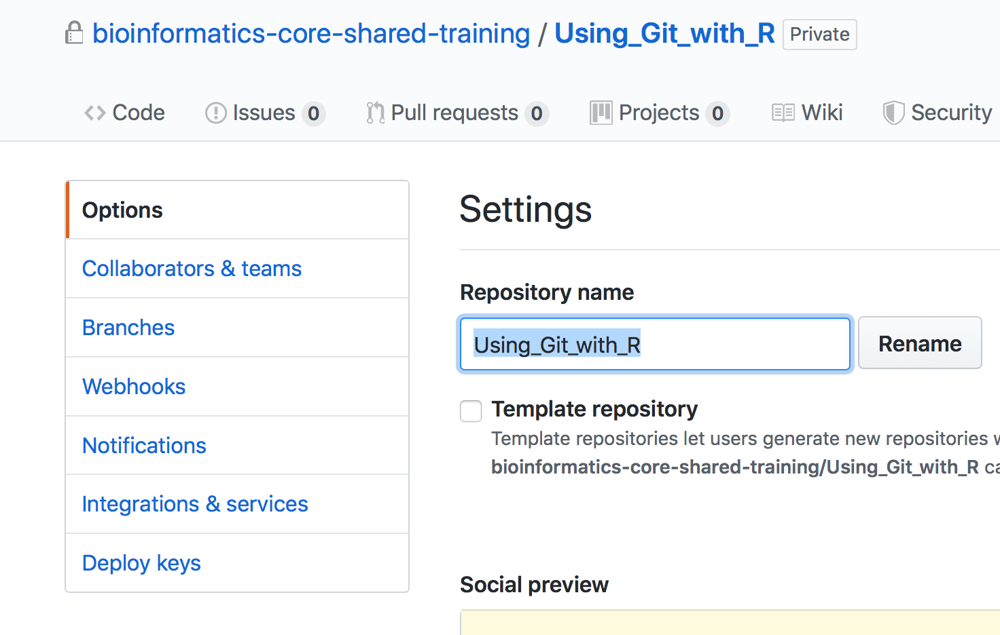 
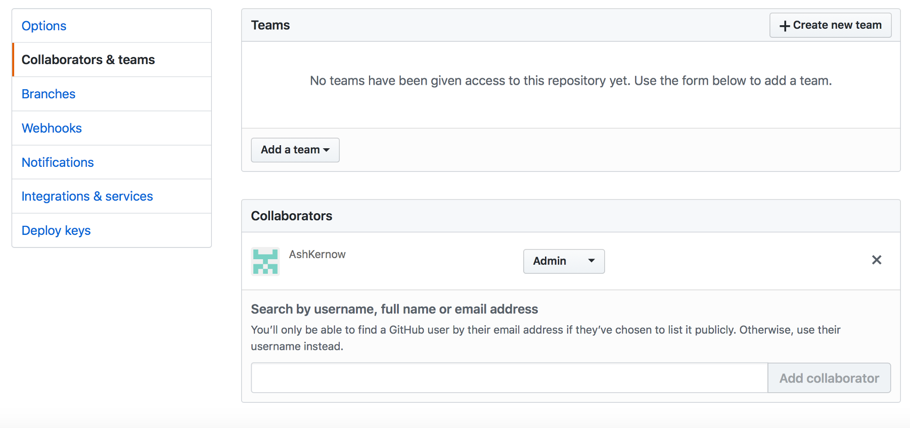 
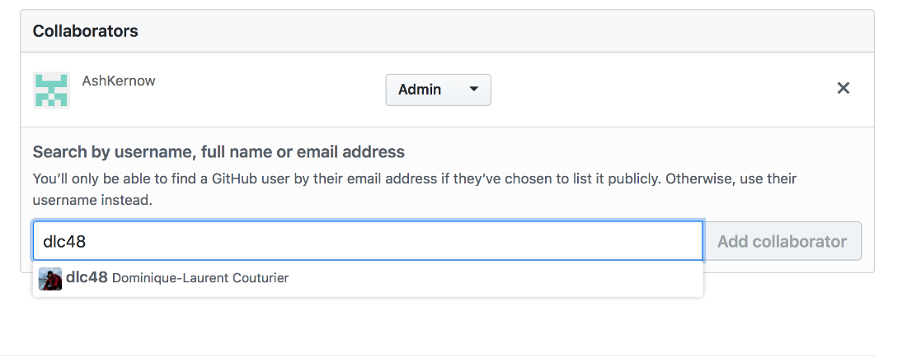 
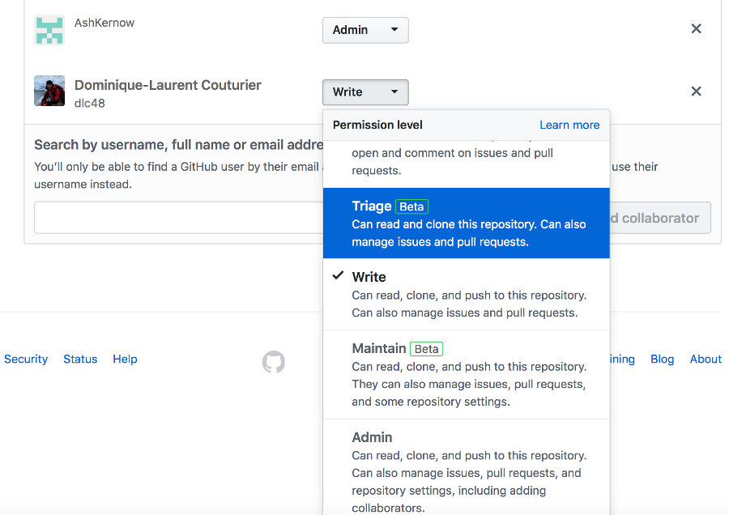 
5. Edit each others files and save(commit) the file changes (practice meaningful commit messages). Note that to edit an existing file you need to click on the pen icon. 
Make ONE of the following changes in each of your neighbours example files:      
a) Add some directions on how to get to the training room.    
b) Add yourself to the list of Trainers.   
c) Change a Resource name in the table of web-links.   
d) Choose a different graphics file to display e.g. instead of SS1_ choose SS2_ or SS4_.   

Explore how GH logs and datestamps this activity.  
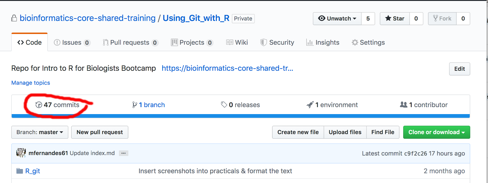 
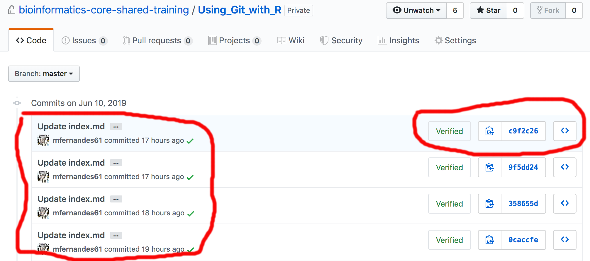 
Git can display the differences made to the file between commits by highlighting in red & green.   
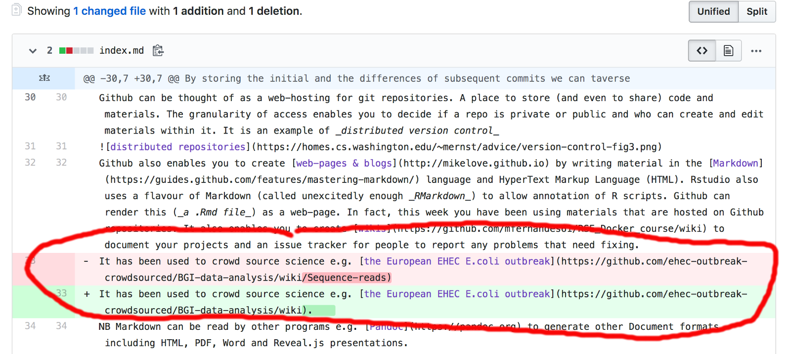 
-End of Exercise-
Example of a 'pull' request to correct a file in a repository.    
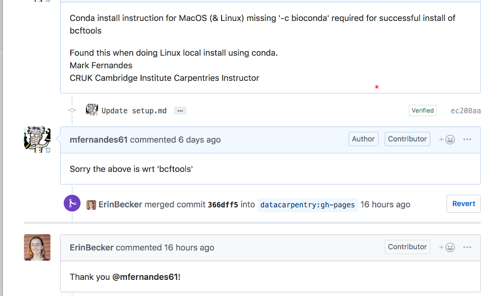    
You can have personal and group/organisation repositories e.g.   
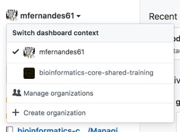 

   
