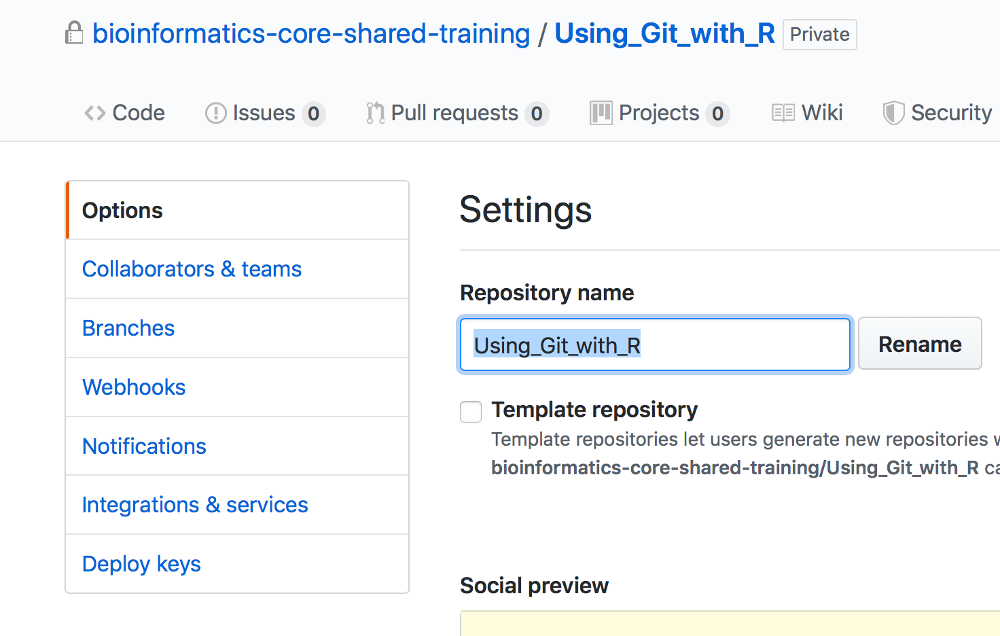

## Practical 1. 
 **For steps 1-4 follow your trainer - this will be 'live-coding'.**       
1. Log into [github](github.com) using your GH account.   
 

 
     
On the LH pane, your repositories will appear here as you create them.   
On the top RH corner are two dropdown menus. The one with your GH avatar if clicked upon will provide you options to change the default settings, alter your profile, log out of GitHub etc. The other one will be used in the next step to create a new GH repository.
2. Create a new repository.   
     
When you have several repos created, Github will list them like this:   
 
3. Create a new simple text file (use Markdown if you know it) [Or go to this page, click & download the example.md file.](https://raw.githubusercontent.com/bioinformatics-core-shared-training/Using_Git_with_R/master/Example.md?token=ADJJD7RWPSCIF3S5ANU4TCC5DXF7G). If this link doesn't work then go [here](Example.md), click on the 'raw' button and use copy & paste.      
To edit a new or existing file you need to click on the pen icon
 
4. Add the the Github usernames for the people on your desk and allow them write privileges to your repsotory and get them to do same for you on theirs.    
 
 
 
 
 
 
5. Edit each others files commit the files. See how GH logs and datestamps this activity.  
 
 
Git can display the differences made to the file between commits by highlighting in red & green.   
 
-End of Exercise-
Example of a 'pull' request to correct a file in a repository.    
    
You can have personal and group/organisation repositories e.g.   
 

   
