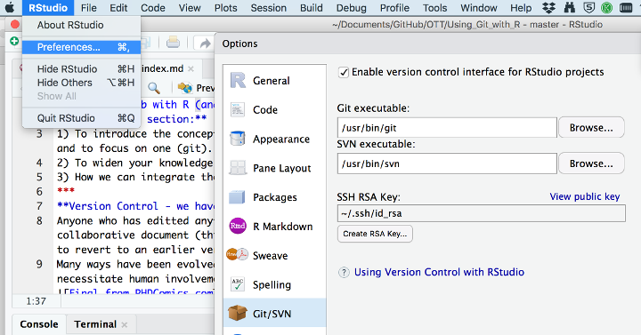
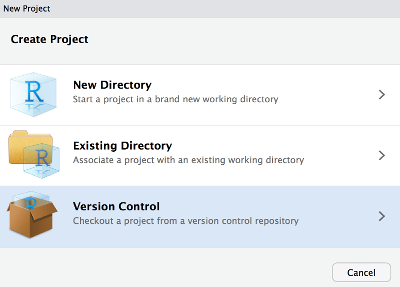
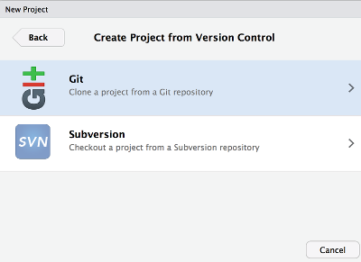
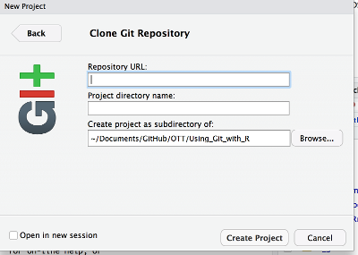
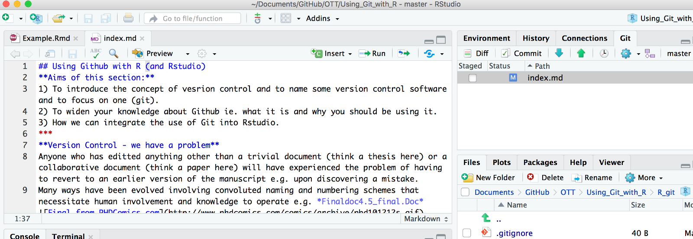
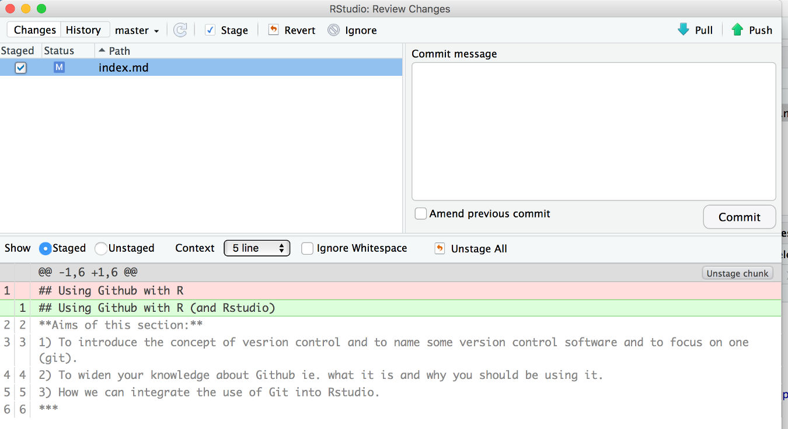
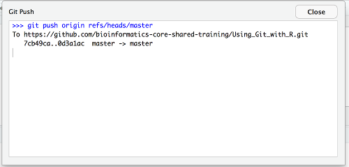
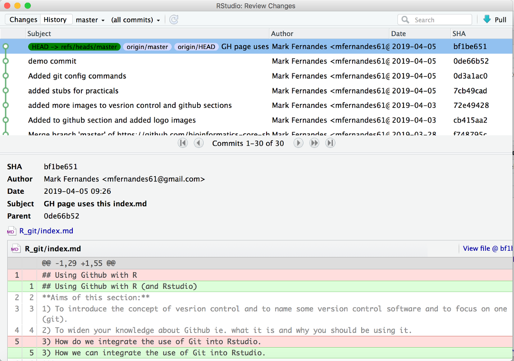

## Practical 2. 
 **Follow trainer who will live-code an example**.      
1. First we have to configure command-line git (only have to do once on a Computer). This is usually done from the command-line but we can do this from within R Studio. Choose Tools followed by Shell then type these two lines:    
> git config --global user.name "Your name".   
> git config --global user.email "Your e-mail adddress".   
_The name and e-mail must be the ones you used when creating your Github account. Rstudio uses this information to connect you to Github._.  
From the shell you can always check these settings with this command:    
> git config --global -l.  

2. Create ssh-key (under Rstudio Preferences).  

3. Configure Rstudio to use git on an existing or new Project.  
.   
Then choose Git as the version control.  
.  
The repository URL can be obtained from the repos GH page - the 'clone or download' button has a descending menu which reveals it. Click on the clipboard icon to copy it into your clipboard. Switch back to Rstudio and paste it into the URL field. Coose a directory name for the project.      
.  
4. In a similar fashion to Exercise 1 we will use an existing  Example.Rmd from the copy of the 'git_in_R' repository on your hard disk. After Opening it we use 'Save as' to store it the your file in your R project directory. Now go to the Tools menu and select the 'version control' - 'commit' option to bring up the Rstudio git interface (You may be asked for a password - this should be the password for the computer you are on).     
.    
5. Use the git interface within Rstudio to commit and display changes.  
Click the checkbox next to your file (Note that added material is displayed below in green and deleted material in red).   

Enter a comment in the commit box and press 'commit' button. This could be done for several files but we are only doing one so now having committed we move onto the step that pushs the committed files to our GH repo.   
.  
This is the button maked 'push' with an up arrow. You should now get a dialogue showing the progress of pushing the file.    
.   
We are able to examine the history from this pane as well.  
 
Try adding and deleting lines and using the commit/push combo to confirm that Rstudios git interface will display and log changes in a similar fashion to the web one we used in Exercise 1.   

--End of Exercise 2--
